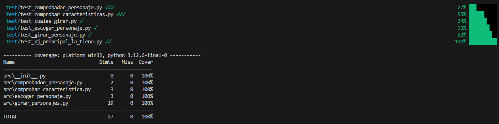

# Quién es quién

**Tabla de contenidos**

-   [**Introducción**](#introducción)
-   [**Manual**](#manual)
    -   [**Pre-requisitos**](#pre-requisitos)
    -   [**Instalación**](#instalación)
    -   [**Uso**](#uso)
-   [**Metodología**](#metodología)
-   [**Descripción técnica**](#descripción-técnica)
    -   [**Requisitos funcionales/no funcionales, NOT LIST**](#partes-interesadas-y-requisitos-funcionalesno-funcionales)
    -   [**Historias de usuaria**](#historias-de-usuaria)
    -   [**Arquitectura de la aplicación**](#arquitectura-de-la-aplicación)
-   [**Diseño**](#diseño)
    -   [**Diagrama de Componentes**](#diagrama-de-componentes)
-   [**Implementacion**](#implementacion)
    -   [**Tecnologías y Herramientas utilizadas**](#tecnologías-y-herramientas-elegidas)
    -   [**Backend**](#backend)
    -   [**Frontend**](#frontend)
-   [**Pruebas**](#pruebas)
    -   [**Coverage**](#coverage)
    -   [**Test de unidad**](#test-de-unidad)
    -   [**Test de integración**](#test-de-integración)
-   [**Análisis del tiempo invertido**](#análisis-del-tiempo-invertido)
    -   [**Wakatime**](#wakatime)
    -   [**Justificación temporal**](#justificación-temporal)
-   [**Conclusiones**](#conclusiones)
    -   [**Posibles mejoras**](#posibles-mejoras)
    -   [**Dificultades**](#dificultades)

## Introducción

Este proyecto es una adaptación del juego clásico ¿Quién es Quién?, en el que intentarás adivinar por descarte el personaje elegido por la máquina. Lo realizamos [Alberto Orihuela Martínez](https://github.com/LxKarcer) y [Miguel Rodríguez Quintás](https://github.com/MiguelRQ24) durante el ultimo mes del primer trimestre de 1º de Desarrollo de Aplicaciones Multiplataforma en el módulo de Programación. 

En este proyecto usamos [Python](https://www.python.org/) para la lógica, y para la creación de sitio web usamos el framework [Reflex](https://reflex.dev/).

## Manual

### Pre-requisitos

-   `Git`
-   `Python3`
-   `pip`
-   `Reflex`

### Instalación

Se recomienda utilizar en 'virtualenv' para instalar todas las dependencias utilizadas por el programa. En [Windows](https://docs.python.org/es/3.8/library/venv.html) lo puedes instalar siguiendo su guía. En **Linux** ejecuta la siguiente instrucción.

```
$ sudo apt-get install python3-venv
```

En el directorio que quiera clone este repositorio.
```
> git clone https://github.com/MiguelRQ24/quien_es_quien.git
```

Entre dentro de la carpeta que se crea al clonar el repositorio.
```
> cd .\quien_es_quien\
```

En este directorio cree el entorno virtual.
``` 
> python -m venv venv
```

Entre en el entorno virtual.
```
> .\venv\Scripts\activate
```

Dentro del entorno virtual instale [Reflex](https://reflex.dev/docs/getting-started/installation/).
```
> pip install reflex
```

### Uso

Para poder jugar al quien es quien ejecute el siguiente comando:
```
> reflex run
```
Cuando termine de compilar entre en el localhost que ponga en `App running at: http://localhost:3000`
```
───────────────────────────────────────────────────────────────────────────────────────── Starting Reflex App ─────────────────────────────────────────────────────────────────────────────────────────
[12:19:26] Compiling: ━━━━━━━━━━━━━━━━━━━━━━━━━━━━━━━━━━━━━━━━ 100% 15/15 0:00:00
───────────────────────────────────────────────────────────────────────────────────────────── App Running ─────────────────────────────────────────────────────────────────────────────────────────────
App running at: http://localhost:3000
Backend running at: http://0.0.0.0:8000
```

## Metodología

Usamos un panel Kanban y la metodología SCRUM que veniamos aplicando en clase durante el curso.

## Descripción técnica

### Requisitos funcionales/no funcionales, NOT LIST

Al comezar el proyecto realizamos la siguiente NOT LIST:

**In scope:** 
-   Menú de Inicio
-   Disposición de Imágenes
-   Input de caracteristicas
-   Validador de caracteristicas
-   Descartar personajes automaticamente
-   Sistema de cambio de imágenes al descartar personajes.
-   Lista de caracteristicas posibles
-   Input de personaje
-   Mostrar el resultado de la partida al jugador
-   Botones de "Volver al menu" y "Volver a jugar"

**Unresolved**
-   Ordenar las imagenes de forma aleatoria
-   Fondo de pantalla, temática estética y/o ambientación
-   Límite de intentos de pregunta
-   Puntuaciones

**Out Scope**
-   Log in
-   Cambio de Idioma
-   Opciones en el menu(descarte de personajes manual)

### Historias de usuaria

[Proyecto Quien es Quien](https://github.com/users/MiguelRQ24/projects/2/views/1)
### Arquitectura de la aplicación

Usuario -> Juego -> Programación
## Diseño 

### Diagrama de Componentes


## Implementacion

### Tecnologías y Herramientas utilizadas

-   **[Python](https://docs.python.org/3.12/)** es un lenguaje de programación de propósito general, lo que significa que se puede utilizar para crear una amplia variedad de aplicaciones y no está especializado en un problema específico.
    
    - **[Random](https://docs.python.org/3/library/random.html)**
    es una libreria que genera números pseudo-aleatorios multiproposito, sus aplicaciones abarcan tanto listas, diccionarios, íntegros, etc.
    
    
    - **[Pytest](https://docs.pytest.org/en/6.2.x/)** es utilizado para escribir casos test y testear las funciones **Python**. 
    
    - **[Coverage](https://pypi.org/project/coverage/)** es una herramienta para medir cuanto porcentage de código está cubierto, requiere tener instalado **Pytest**. 
 
- **[Reflex](https://reflex.dev/docs/library/)**
    - Reflex es un framework para python y su utilizacion en entornos de navegador que usa implementaciones de 

### Backend
La primera funcion del backend es escoger aleatoriamente el personaje a adivinar. 

```python
from random import choice

def escoger_personaje(personajes):
    return choice(personajes)

```

En esta parte del código comprobamos si el intento de adivinar del usuario es correcto.

```python
def comprobador_pers(personaje_elegido,input_usuario):
    return personaje_elegido == input_usuario.lower() 
```

En este segmento de código comprobamos si la característica introducida por el usuario és válida o no.

```python
from quien_es_quien.personajes.personajes import caracteristicas 
def caracteristica_valida(atributo):
    return atributo.lower() in caracteristicas

```

Aquí comprobamos que personajes debemos girar con la función `cuales_girar_pjs()`, para realizarlo correctamente llama a la función `pj_principal_la_tiene()` para saber si el personaje elegido tiene o no la caracteristica enviada por el usuario.

```python
import quien_es_quien.personajes.personajes as pjs
def pj_principal_la_tiene(caracteristica, personaje_principal):
    return True if caracteristica.lower() in pjs.personajes[personaje_principal] else False

def cuales_girar_pjs(caracteristica, personaje_girados, personaje_principal):
    personajes_a_girar = []
    la_tiene = pj_principal_la_tiene(caracteristica, personaje_principal)
    for personaje in pjs.personajes.keys():
        if personaje not in personaje_girados:
            if la_tiene:
                if caracteristica.lower() not in pjs.personajes[personaje]:
                    personajes_a_girar.append(personaje)
            else:
                if caracteristica.lower() in pjs.personajes[personaje]:
                    personajes_a_girar.append(personaje)
    return personajes_a_girar
```

Este segmento de código se encarga de cambiar el valor a `True` de cada personaje en el diccionario `girados` que este en la lista `personajes_a_girar` que nos devuelve la anterior función.
```python
def girar_pjs(girados, personajes_girar):
    for personaje in personajes_girar:
        girados[personaje] = True
    return girados
```


### Frontend

Asi es el apartado visual de la pagina web, esta en el directorio [paginas](./quien_es_quien/paginas/) dentro del quien_es_quien


## Pruebas

### Coverage


### Test Unidad


### Test Integración

No se han realizado.

## Análisis del tiempo invertido

### Wakatime

Para controlar el tiempo utilizado hemos usado Wakatime:


### Justificación temporal

Basandonos en los graficos anteriores lo que mas tiempo nos llevo fue comprender el framework [Reflex](https://reflex.dev/docs/library/), ya que la lógica del juego la resolvimos sin ningun problema.

## Conclusiones

Durante el Desarrollo de este juego hemos aprendido bastante tanto sobre el manejo de GIT como sonbre GitHub. Tambien que aunque el framework [Reflex](https://reflex.dev/docs/library/) nos fuese complicado de comprender, sin el uso de este nunca habría habido interfaz en el juego.

### Posibles mejoras

-   Ordenar las imagenes de forma aleatoria
-   Fondo de pantalla, temática estética y/o ambientación
-   Límite de preguntas de caracteristicas
-   Puntuaciones
-   Sistema de Clasificación

### Dificultades

Tuvimos dificultades con [Reflex](https://reflex.dev/docs/library/) ya que ninguno teniamos conocimiento sobre este framework y tampoco sobre HTML o CSS. Pero el resto lo resolvimos sin problemas. 